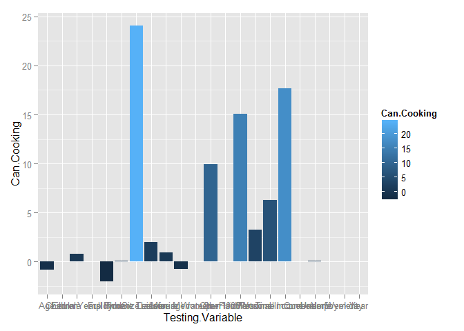
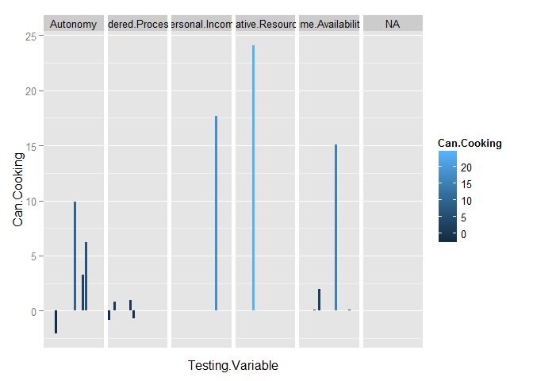
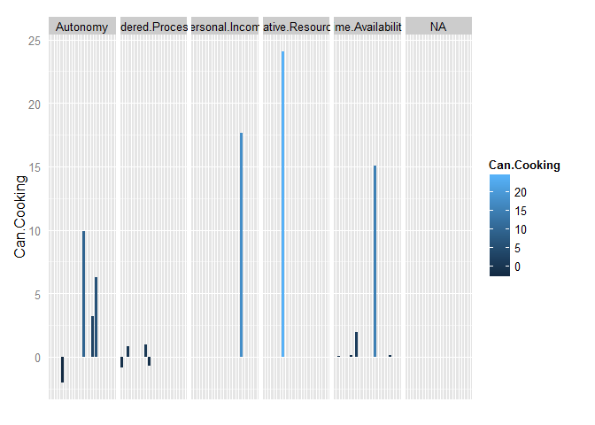
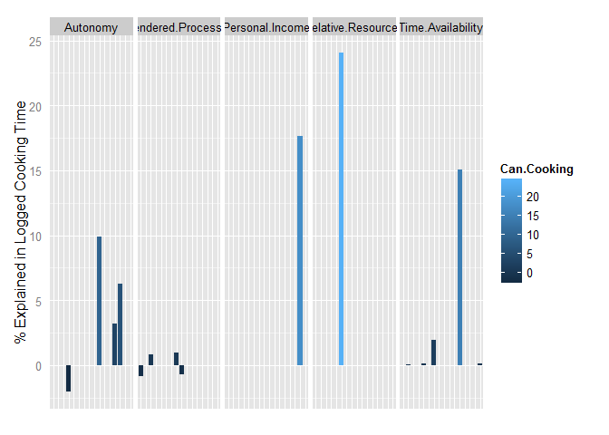
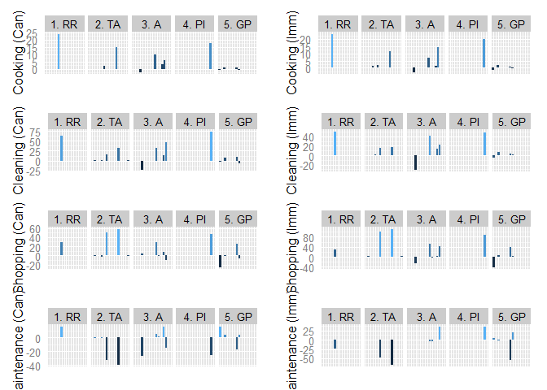

# Bar Charts
Kamila Kolpashnikova  

For this demostration, I am going to use a dataset derived from the Canadian GSS. The observations report coefficients for the Oaxaca-Blinder decomposition models.


```r
library(downloader) 
url <- "https://raw.githubusercontent.com/Kolpashnikova/R-codes/master/for%20r%20decomposition.csv"
filename <- basename(url)
download(url, destfile=filename)
decomposition <- read.csv(filename, header = T)
```

Let's try out a bar plot from the ggplot library and plot the testing framworks and their respective explanatory powers.


```r
colnames(decomposition)[1]<-"Testing.Variable"
library(ggplot2)
ggplot(decomposition, aes(x = Testing.Variable, y = Can.Cooking, fill=Can.Cooking)) + 
    geom_bar(stat = 'identity', position = 'stack') 
```

 
 
Right now all of the testing variables are together in one bundle. Since I want to know which framework each of the testing variables refer to, I create a new variable with the testing frameworks and bind it with the original table. I call the new resulting table `ddata`.


```r
Framework<-c("Relative.Resources", "Time.Availability", 
             "Time.Availability", "Time.Availability", "Time.Availability", 
             "Time.Availability", "Autonomy", "Autonomy", "Autonomy", 
             "Autonomy", "Autonomy", "Personal.Income", "Gendered.Processes", 
             "Gendered.Processes", "Gendered.Processes", "Gendered.Processes", 
             NA, NA, NA, NA, NA, NA)
ddata<-cbind(decomposition,Framework)
```

Now that I have all the needed components, I can try and divide my bar charts by fraeworks.


```r
ddata$Testing.Variable <- as.factor(ddata$Testing.Variable) 
levels(ddata$Testing.Variable)
```

```
##  [1] "Age"                    "Children"              
##  [3] "EduIn Years"            "Female employment"     
##  [5] "Full Time"              "HhldSize"              
##  [7] "Income Transfer"        "Leisure"               
##  [9] "Leisure Men"            "Leisure Women"         
## [11] "Marriage rate per 1000" "Other"                 
## [13] "Own Home"               "Paid Work"             
## [15] "Part Time"              "Personal Income"       
## [17] "Personal Income Alone"  "Quebec"                
## [19] "Under5"                 "Unempoyment"           
## [21] "Weekday"                "Year"
```

```r
ggplot(ddata, aes(x = Testing.Variable, y = Can.Cooking, fill=Can.Cooking), 
    na.rm=T) + 
    geom_bar(stat = "identity", position = "dodge", na.rm=T) + 
    facet_grid(~ Framework) + scale_x_discrete(breaks = NULL)
```

 

Well, first I want to get rid of the x label since it doesn't really help.


```r
ggplot(ddata, aes(x = Testing.Variable, y = Can.Cooking, fill=Can.Cooking), 
       na.rm=T) + 
    geom_bar(stat = "identity", position = "dodge", na.rm=T) + 
    facet_grid(~ Framework) + 
    theme(axis.ticks = element_blank(), axis.text.x = element_blank(),
          axis.title.x = element_blank())
```

 

Now I have a column 'NA' for the variables which are not in any frameworks. I would want to change my dataset a bit in a way so that I could use only the data for the framework.


```r
ddata1<-ddata[1:16,]
ggplot(ddata1, aes(x = Testing.Variable, y = Can.Cooking, fill=Can.Cooking), 
       na.rm=T) + 
    geom_bar(stat = "identity", position = "dodge", na.rm=T) + 
    facet_grid(~ Framework) + 
    theme(axis.ticks = element_blank(), axis.text.x = element_blank(),
          axis.title.x = element_blank()) +
    ylab("% Explained in Logged Cooking Time")
```

 

I notice that the names for frameworks are too long and that is why I decide to use abbreviations for them but first I need to create a separate variable and bind them together with the dataset.


```r
F<-c("1. RR", "2. TA", "2. TA", "2. TA", "2. TA", "2. TA", "3. A",  
     "3. A", "3. A", "3. A", "3. A", "4. PI", "5. GP", "5. GP", "5. GP",
     "5. GP")
ddata1<-cbind(ddata1, F)
```

Now we can plot:

### Explained Time Spent on Cooking by Canadians (let's call it p1):


```r
p1<-ggplot(ddata1, aes(x = Testing.Variable, y = Can.Cooking, fill=Can.Cooking), 
       na.rm=T) +
    geom_bar(stat = "identity", position = "dodge", na.rm=T) + 
    facet_grid(~ F) + 
    theme(axis.ticks = element_blank(), axis.text.x = element_blank(),
          axis.title.x = element_blank(), legend.position="none") +
    ylab("Cooking (Can)") 
```

Let's create other plots for immigrants and Canadians by each domestic task ( plots p2-p8)


```r
p2<-ggplot(ddata1, aes(x = Testing.Variable, y = Imm.Cooking, fill=Imm.Cooking), 
       na.rm=T) +
    geom_bar(stat = "identity", position = "dodge", na.rm=T) + 
    facet_grid(~ F) + 
    theme(axis.ticks = element_blank(), axis.text.x = element_blank(),
          axis.title.x = element_blank(), legend.position="none") +
    ylab("Cooking (Imm)") 

p3<-ggplot(ddata1, aes(x = Testing.Variable, y = Can.Cleaning, fill=Can.Cleaning), 
           na.rm=T) +
    geom_bar(stat = "identity", position = "dodge", na.rm=T) + 
    facet_grid(~ F) + 
    theme(axis.ticks = element_blank(), axis.text.x = element_blank(),
          axis.title.x = element_blank(), legend.position="none") +
    ylab("Cleaning (Can)") 

p4<-ggplot(ddata1, aes(x = Testing.Variable, y = Imm.Cleaning, fill=Imm.Cleaning), 
           na.rm=T) +
    geom_bar(stat = "identity", position = "dodge", na.rm=T) + 
    facet_grid(~ F) + 
    theme(axis.ticks = element_blank(), axis.text.x = element_blank(),
          axis.title.x = element_blank(), legend.position="none") +
    ylab("Cleaning (Imm)") 

p5<-ggplot(ddata1, aes(x = Testing.Variable, y = Can.Shopping, fill=Can.Shopping), 
           na.rm=T) +
    geom_bar(stat = "identity", position = "dodge", na.rm=T) + 
    facet_grid(~ F) + 
    theme(axis.ticks = element_blank(), axis.text.x = element_blank(),
          axis.title.x = element_blank(), legend.position="none") +
    ylab("Shopping (Can)") 

p6<-ggplot(ddata1, aes(x = Testing.Variable, y = Imm.Shopping, fill=Imm.Shopping), 
           na.rm=T) +
    geom_bar(stat = "identity", position = "dodge", na.rm=T) + 
    facet_grid(~ F) + 
    theme(axis.ticks = element_blank(), axis.text.x = element_blank(),
          axis.title.x = element_blank(), legend.position="none") +
    ylab("Shopping (Imm)") 

p7<-ggplot(ddata1, aes(x = Testing.Variable, y = Can.Maintenance, fill=Can.Maintenance), 
           na.rm=T) +
    geom_bar(stat = "identity", position = "dodge", na.rm=T) + 
    facet_grid(~ F) + 
    theme(axis.ticks = element_blank(), axis.text.x = element_blank(),
          axis.title.x = element_blank(), legend.position="none") +
    ylab("Maintenance (Can)") 

p8<-ggplot(ddata1, aes(x = Testing.Variable, y = Imm.Maintenance, fill=Imm.Maintenance), 
           na.rm=T) +
    geom_bar(stat = "identity", position = "dodge", na.rm=T) + 
    facet_grid(~ F) + 
    theme(axis.ticks = element_blank(), axis.text.x = element_blank(),
          axis.title.x = element_blank(), legend.position="none") +
    ylab("Maintenance (Imm)") 
```

To plot multiple plots we can borrow one wonderful function `multiplot` and build our plots using that. You will find it in the codes folder `multiplot.R`. You have to run it to make it appear in your global environment.


```r
multiplot(p1, p2, p3, p4, p5, p6, p7, p8, layout=matrix(c(1,2,3,4,5,6,7,8), nrow=4, byrow=TRUE))
```

 
