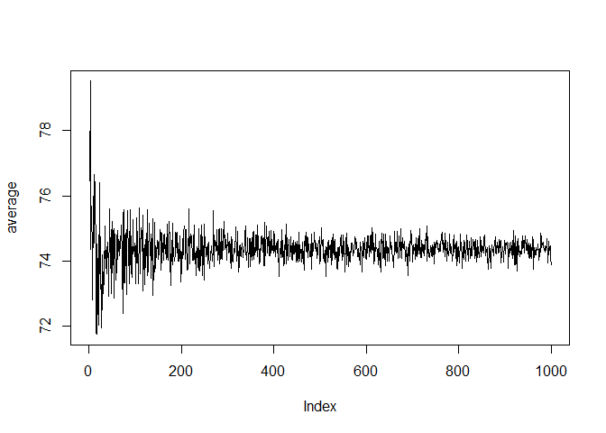
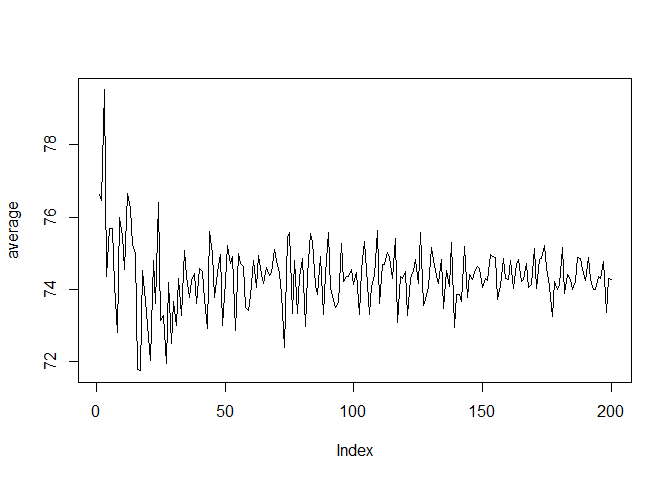

# plotting simulations
Kamila Kolpashnikova  

For this demostration, I am going to use a dataset from my github `data.csv`.


```r
library(downloader) 
url <- "https://raw.githubusercontent.com/Kolpashnikova/R-codes/master/data.csv"
blah <- basename(url)
download(url, destfile=blah)
data <- read.csv(blah, header = T)
```

## Subsetting 

Now let's subset the dataset only to women and those who do not have missing values in `DVCOOK` variable.


```r
Women<-data[data$Female==1,]
Women1<-subset(Women,!is.na(Women$DVCOOK))
```
 
## Plotting simulations

We can plot simulations of 100 times for a sample that gradually increases to 1000.


```r
set.seed(1)
n <- 100
amean <- vector("numeric",n)
average<-vector("numeric",1000)
for(j in 1:1000){
    for (i in 1:n) {
        asample <- sample(Women1$DVCOOK,2+j)
        amean[i] <- mean(asample)
    }
    average[j]<-mean(amean)
}

plot(average, type='l')
```

 

We see that around a sample of 200 the simulations converge, so we can reduce the graph to a sample of 200.


```r
set.seed(1)
n <- 100
amean <- vector("numeric",n)
average<-vector("numeric",200)
for(j in 1:200){
    for (i in 1:n) {
        asample <- sample(Women1$DVCOOK,2+j)
        amean[i] <- mean(asample)
    }
    average[j]<-mean(amean)
}

plot(average, type='l')
```

 
