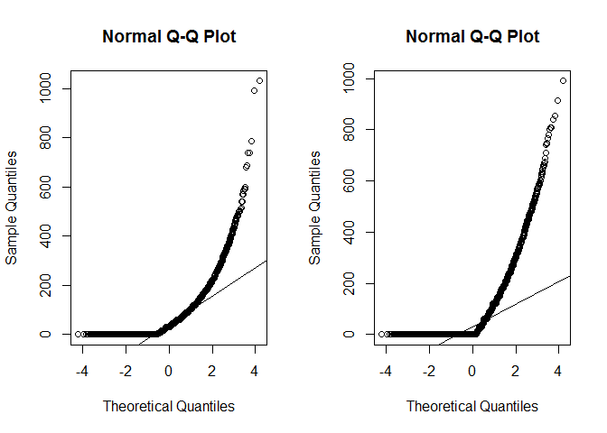

# qqplots
Kamila Kolpashnikova  

# Making Multiple QQ plots

Let's first load the dataset.


```r
library(downloader) 
url <- "https://raw.githubusercontent.com/Kolpashnikova/R-codes/master/data.csv"
blah <- basename(url)
download(url, destfile=blah)
data <- read.csv(blah, header = T)
```

If we want to have multiple plots in one window, we specify it with the command `par`.


```r
par(mfrow=c(1,2))
```

Since above we specify that we want to have two graphs in one row, we then provide those two graphs to plot.


```r
qqnorm(data$DVCOOK)
qqline(data$DVCOOK)
qqnorm(data$DVCLEAN)
qqline(data$DVCLEAN)
```

 
