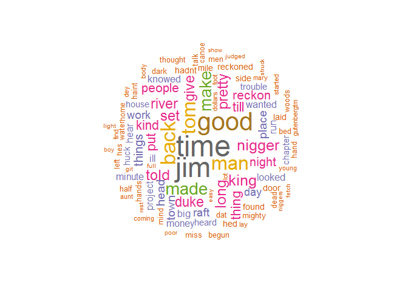

# wordcloud
Kamila Kolpashnikova  

# Making a wordcloud with a text

You can download a text from a publicly available sourse or use your own .txt file.


```r
library(NLP)
library(RColorBrewer)
library(tm)
library(wordcloud)
library(memoise)

library(downloader) 
url <-"http://www.gutenberg.org/cache/epub/76/pg76.txt"
filename <- basename(url)
download(url, destfile=filename)
huckleberry<-readLines(filename, encoding = "UTF-8")
```

Now we need to create a corpus:


```r
myCorpus <- Corpus(VectorSource(huckleberry))
myCorpus <- tm_map(myCorpus, content_transformer(tolower))
myCorpus <- tm_map(myCorpus, removePunctuation)
myCorpus <- tm_map(myCorpus, removeNumbers)
myCorpus <- tm_map(myCorpus, removeWords,
                   c(stopwords("SMART"), "to", "and", "but", "skills", "dont", 
                     "warnt", "wouldnt", "couldnt", "didnt", "aint", "wont"))
```

If you need to remove some of the words that appear in the word cloud that you do not want to appear, you need to add them to the list above.


```r
wordcloud(myCorpus, scale=c(3,.2), min.freq=30, max.words=100, random.order=FALSE,
          rot.per=0.35, use.r.layout=FALSE, colors=brewer.pal(8, "Dark2"))
```

 

